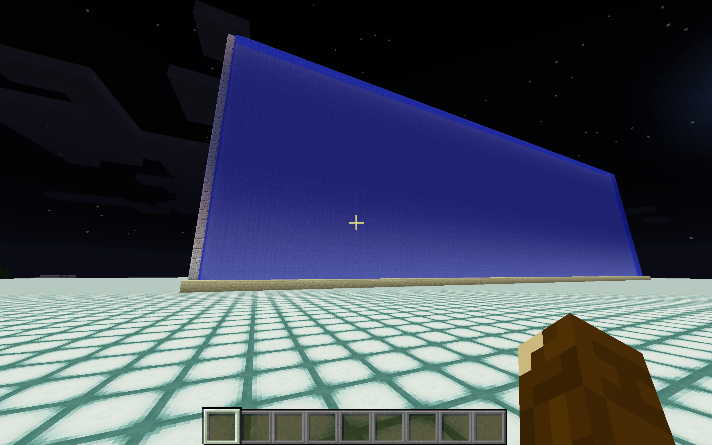

# mcFunctionDev
Minecraft function development using golang

 

### About

As of Minecraft version 1.12 (released on June 7, 2017) external
function files can be input to Minecraft providing a list of commands
to be executed. Such functions can be invoked in Minecraft at any time
to do a wide variety of tasks.

One important command is "fill" which can be used to place blocks
anywhere in the game of any type. This allows arbitrary structures to
be built.

One way to utilize this capability is to have an external code which
produces Minecraft functions that can be used inside the game. The
goal of this project, mcFunctionDev, is to develop external code
that generates Minecraft functions for a variety of structures.

The development language for this project is golang, partly because it
is a great, modern language and partly because this project is an easy
way of learning the language basics.

### Go Get

    go get github.com/GreenSeaTurtle/mcFunctionDev

### Example 1:

Below is a Minecraft screenshot of a waterfall produced by
mcFunctionDev.

mcFunctionDev is run and produces Minecraft function files to generate
the waterfall in various orientations. An example of such a function
file that essentially produces the waterfall above is:

fill ~0 ~0 ~-2 ~99 ~0 ~-2 minecraft:sandstone  
fill ~0 ~0 ~-3 ~0 ~0 ~-3 minecraft:sandstone  
fill ~99 ~0 ~-3 ~99 ~0 ~-3 minecraft:sandstone  
fill ~0 ~0 ~-4 ~0 ~30 ~-4 minecraft:stone 4  
fill ~0 ~27 ~-6 ~0 ~30 ~-5 minecraft:stone 4  
fill ~99 ~0 ~-4 ~99 ~30 ~-4 minecraft:stone 4  
fill ~99 ~27 ~-6 ~99 ~30 ~-5 minecraft:stone 4  
fill ~0 ~30 ~-6 ~98 ~27 ~-6 minecraft:stone 4  
fill ~1 ~27 ~-5 ~98 ~27 ~-5 minecraft:stone 4  
fill ~1 ~0 ~-4 ~98 ~29 ~-4 minecraft:sandstone  
fill ~1 ~28 ~-5 ~98 ~28 ~-5 minecraft:flowing_lava  
fill ~1 ~29 ~-5 ~98 ~29 ~-5 minecraft:glass  
fill ~1 ~30 ~-5 ~98 ~30 ~-5 minecraft:flowing_water

This is a "north" waterfall. It faces south and runs from west to
east. Function files for "east", "south", and "west" waterfalls are
also produced. Additional function files are generated that replace
the water with lava producing lavafalls.

The "\~" symbol in the above function file refers to the player's
current position in the game. The number after the "\~" gets added to
the players position to generate x, y, and z coordinates for two
corners that define the fill box. The box is filled with blocks with a
type specified by the last argument to the fill command, for example
sandstone, lava, glass, etc.

A minor point is that extra spaces are not allowed in these
fill commands. This perhaps will be fixed in some future
version of Minecraft.

It may seem odd that the waterfall above has lava in it. At higher
elevation and with a waterfall that is tall enough, the water at the
top can freeze and form ice. This is prevented by by having a hidden
layer of lava below the water and seperated by a glass layer.

### Example 2:

Below is a Minecraft screenshot of several spheres produced by
mcFunctionDev.

As with the waterfall example above, the sphere mcfunction file
contains a number of Minecraft fill commands, a very large number of
fill commands since each block is placed with one fill command. For
example, a sphere of radius 20 with the interior completely filled
needs 33401 fill commands. While this seems like a lot, it executes in
Minecraft very quickly.
