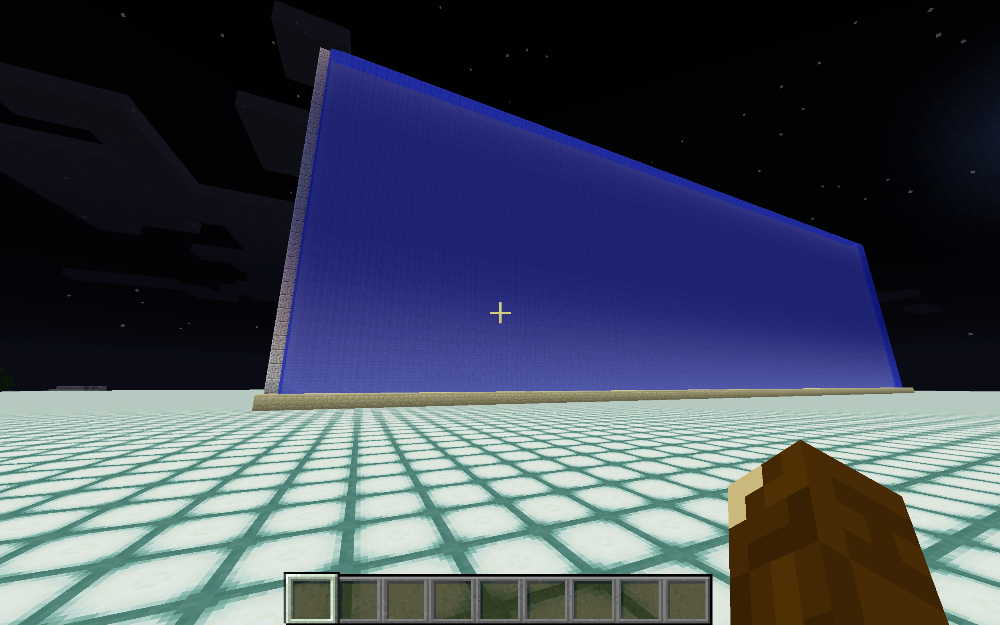

# mc_function_dev
Minecraft function development using golang

As of Minecraft version 1.12 (anticipated to be released on June 2,
2017) external function files can be input to Minecraft providing a
list of commands to be executed. Such functions can be invoked in
Minecraft at any time to do a wide variety of tasks.

One important command is "fill" which can be used to place blocks
anywhere in the game of any type. This allows arbitrary structures to
be built.

One way to utilize this capability is to have an external code which
produces Minecraft functions that can be used inside the game. The
goal of this project, mc_function_dev, is to develop external code
that generates Minecraft functions for a variety of structures.

The development language for this project is golang, partly because it
is a great, modern language and partly because this project is an easy
way of learning the language basics.

Example 1:

This is an example

